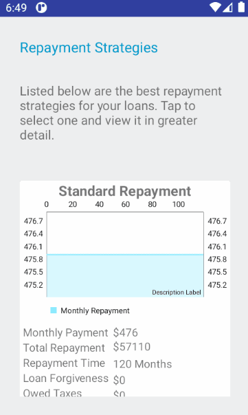

<!-- [![LGPL License][license-shield]][license-url] -->
<!-- [![LinkedIn][linkedin-shield]][linkedin-url] -->

<!-- PROJECT LOGO -->
 

<h2 align="center">Student Loan Wizard</h2>

    
    

    An android app for getting the most out of your student loan repayment.
    

<!-- ABOUT THE PROJECT -->
## About

[More Information in Portfolio](http://www.eobgauge.com/slw)

Student Loan Wizard shows you how to save the most money through student loan repayment and forgiveness programs.

* Save money by choosing the right repayment plan for your circumstances
* Combine with federal loan forgiveness you may already be eligible for
* Pay thousands less in taxes on any forgiven loans
* Interactive questionnaire to determine if you're already eligible for complete loan forgiveness

<!-- GETTING STARTED -->
## Installation

~~You'll find the this program on [Android Market](https://market.android.com/details?id=com.balcorasystems.slw)~~

As of Q1 2018 Student Loan Wizard is defunct due to changes in the US FedLoan system which severely curtail loan forgiveness and eliminate a number of advantageous loan repayment options. [Read more here](https://www.nbcnews.com/think/opinion/betsy-devos-refusal-honor-student-loan-forgiveness-shows-her-disrespect-ncna1234074)

<!-- USAGE EXAMPLES -->
## Usage

Getting started with Student Loan Wizard is easy, you've got two options, either enter your FedLoan user ID and password and SLW will automatically download your loans or you can make a manual entry of what you owe and to whom.

In either choice on your first run you'll be presented with an interactive questionnaire to determine which programs you're eligible for and whether you can qualify for loan forgiveness.

Once you've answered the questions SLW presents you with a list of the best repayment plans that minimize either your monthly payment or your long term repayment along with any forgiven loan tax liability. If you already qualify for total loan forgiveness it'll show you exactly what forms you'll need to submit for your particular loan servicer.

<!-- LICENSE -->
## License

Distributed under the LGPL License.
